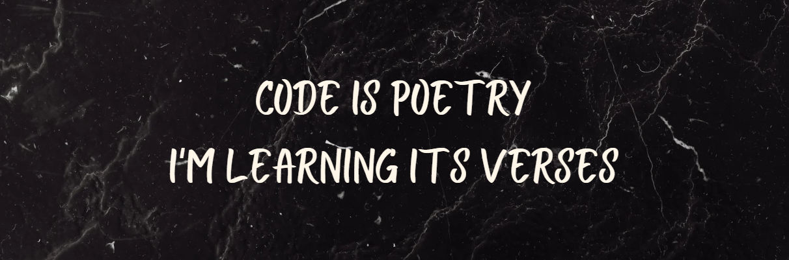

</img>

## :wave: Hi! welcome to Wade's GitHub Page

### :space_invader: &nbsp;About Me

&nbsp;&nbsp;&nbsp;:technologist: &nbsp;I am a Frontend Engineer \
&nbsp;&nbsp;&nbsp;:seedling: &nbsp;Love for science and innovation.\
&nbsp;&nbsp;&nbsp;:heartbeat: &nbsp;Passionate with problem solving and daily routines automation.\

  <a href="https://adad09382.github.io/">Wade's Personal website</a>&nbsp;&nbsp;&nbsp;&nbsp;

  
<b>:computer: &nbsp;Main tech knowledge</b>

   

<!--
HTML, CSS, JavaScript, JQuery, SASS, bootstrap
Vue, Vuetify
Git, GitHub
NodeJS, Python
MongoDB
-->

  
<b>:brain: &nbsp;Other knowledge, always learning</b>

   

&nbsp;
&nbsp;\
&nbsp;
&nbsp;
&nbsp;
&nbsp;

<!--
Illustrator, photoshop
blockchain, cryptocurrencies, cryptography, bitcoin, ethereum
-->

